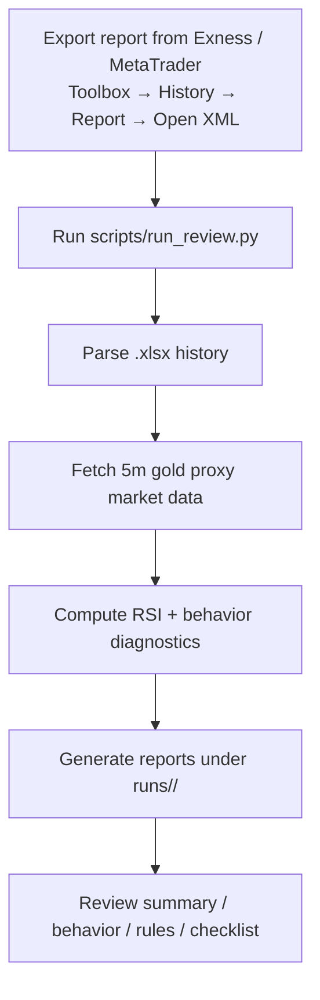

# Exness Trade Review Skill

[中文说明 / Chinese README](./README_cn.md)

A reusable OpenClaw skill for reviewing Exness-exported XAUUSD trade history.

This project focuses on:
- parsing Exness `.xlsx` history exports
- reconstructing 5m gold market context
- computing RSI-based context signals
- detecting execution-quality problems such as rapid re-entry, rapid flips, clustered trading, and reactive short-hold trades
- generating structured review reports for daily or multi-day coaching

## Recommended input format

Use the `.xlsx` file exported from the Exness / MetaTrader client with this path:

**Toolbox → History → right click → Report → Open XML**

That Open XML export format is the recommended input for this skill.

## Simple flow



## What this skill is good at

- daily Exness trade review
- comparing healthy vs dangerous trading days
- identifying impulsive execution patterns
- turning raw trading history into structured behavior reports

## What this skill is not

- a tick-accurate broker microstructure analyzer
- a guaranteed strategy generator
- a substitute for broker-native execution logs

## Repository structure

- `README.md` — English repository overview
- `README_cn.md` — Chinese repository overview
- `SKILL.md` — skill metadata and workflow
- `scripts/` — runnable review pipeline
- `references/` — interpretation and trading-rules references

## Main script

Run the full review pipeline with:

```bash
python scripts/run_review.py --input /path/to/report.xlsx --run-name my-run
```

Output will be written under:

```bash
runs/my-run/
```

including:
- `processed/trade_analysis.csv`
- `reports/overview.txt`
- `reports/summary.txt`
- `reports/behavior_report.txt`
- `reports/execution_rules.txt`
- `reports/risk_windows_report.txt`
- `reports/pretrade_checklist.txt`

## Public-project style usage examples

### Example 1: Review one day

```bash
python scripts/run_review.py --input ./ReportHistory_20260402.xlsx --run-name 20260402
```

Then inspect:
- `runs/20260402/reports/overview.txt`
- `runs/20260402/reports/summary.txt`
- `runs/20260402/reports/behavior_report.txt`

### Example 2: Review multiple days

```bash
python scripts/run_review.py --input ./ReportHistory_20260401.xlsx --run-name 20260401
python scripts/run_review.py --input ./ReportHistory_20260402.xlsx --run-name 20260402
```

Then compare:
- net result by day
- rapid re-entry behavior
- clustered trading patterns
- whether the day looks healthy, dangerous, or mixed

### Example 3: Typical workflow for coaching

1. Export the report from Exness / MetaTrader.
2. Run the review pipeline.
3. Read the `overview.txt` first.
4. Read `behavior_report.txt` and `execution_rules.txt` next.
5. Use `pretrade_checklist.txt` as the practical follow-up.

## Notes

- Do not commit real account exports or generated run artifacts.
- This repository's `.gitignore` is set to ignore local `.xlsx`, `.csv`, and `runs/` outputs.
